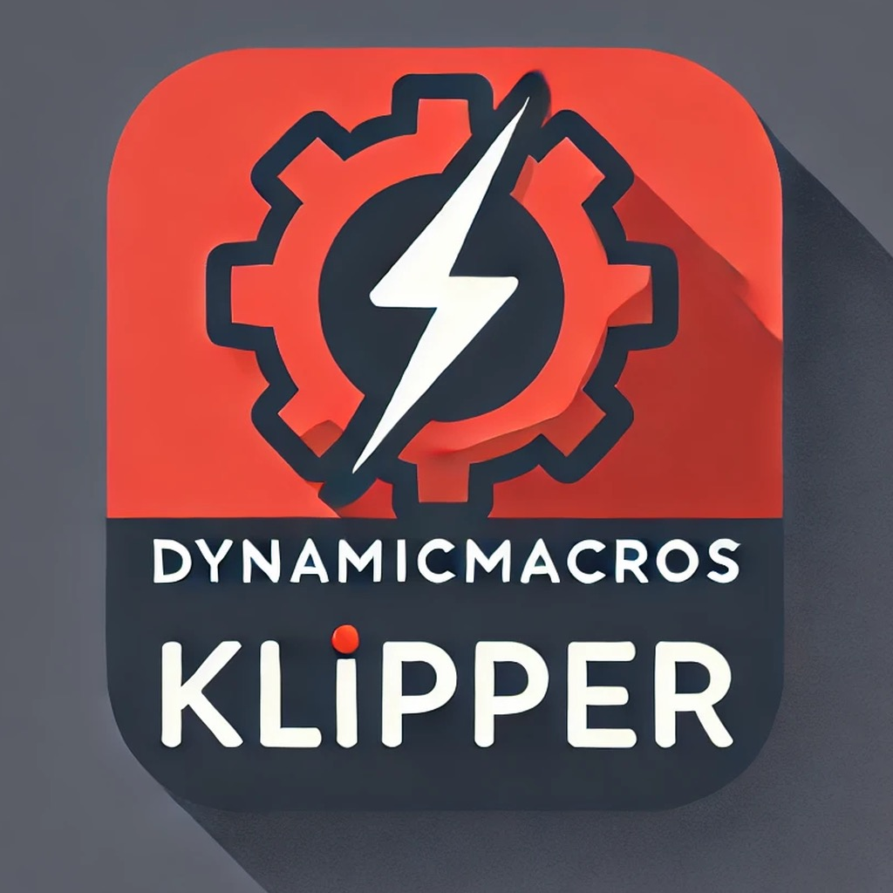

# Klipper Dynamic Macros

**Never restart Klipper again for simple macros...and so much more**

---

Klipper Dynamic Macros is an unofficial way to update macros without restarting Klipper, so you can update macros mid-print and see their results live. It also supports extra features that normal GCode Macros don't have.

## Documentation

Read the documentation [here](https://3dcoded.github.io/DynamicMacros)

## More Projects

If you like this project, don't forget to give it a star! Also, check out my other projects:

- [3MS](https://github.com/3dcoded/3ms), a modular multimaterial system for Klipper
- [KlipperMaintenance](https://github.com/3DCoded/KlipperMaintenance), maintenance reminders for Klipper

## Features

- [Recursion](https://3dcoded.github.io/DynamicMacros/features/recursion)
- [Receiving Variables](https://3dcoded.github.io/DynamicMacros/features/receivingvariables)
- [Utility Functions](https://3dcoded.github.io/DynamicMacros/features/utilities)
- [Variables](https://3dcoded.github.io/DynamicMacros/features/variables)
- [Python](https://3dcoded.github.io/DynamicMacros/features/python)
- [Delayed GCode](https://3dcoded.github.io/DynamicMacros/features/delayed)
- [Macro Clusters](https://3dcoded.github.io/DynamicMacros/features/clusters)
- [Rendering Macros](https://3dcoded.github.io/DynamicMacros/features/rendering)

## How Normal Macros Work

Your macros are written in a `.cfg` file, then included into your `printer.cfg`. When Klipper restarts, it parses these files and saves the macros internally (you can't change them without restarting Klipper). When a macro is called, the cached code is interpreted and run.

## How Dynamic Macros Work

Your macros are written in a `.cfg` file, then the relative path to that file is configured in a `[dynamicmacros]` config section. The config files are read and parsed every time you run the `DYNAMIC_MACRO` command, allowing you to update macros without restarting Klipper.

## Get Started
Follow the [Tutorial](https://3dcoded.github.io/DynamicMacros/tutorial) to get started with Dynamic Macros.

## Features

See [Development Status](https://3dcoded.github.io/DynamicMacros/devstatus) for the currently available features, and planned features.
