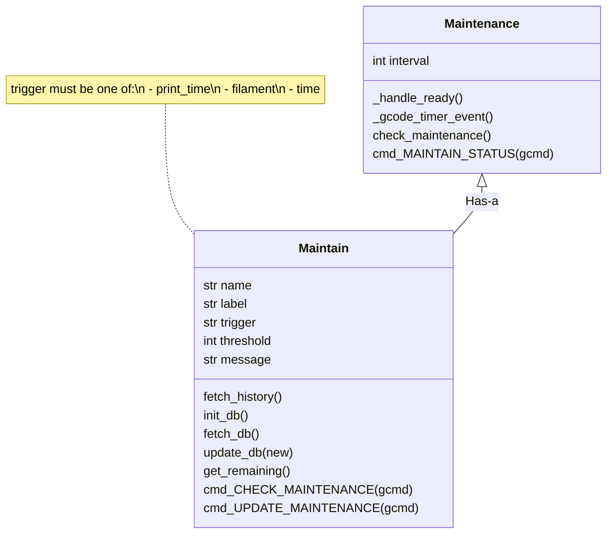

# Example 3: KlipperMaintenance

This last example of the Klippy extra development tutorial is actually one of my other Klipper projects: [KlipperMaintenance](https://github.com/3DCoded/KlipperMaintenance), a maintenance reminder system for Klipper.

This example will go through how the KlipperMaintenance code works to teach a few more important things about developing Klippy extras.

## Full Code

For this tutorial, we'll start with the full code, then break it down and explain what each section does. If you can learn to read existing Klippy extras, you can read the [builtin Klippy extras](https://github.com/Klipper3d/klipper/tree/master/klippy/extras) when developing your own extras.

???+ quote "Full Code"
    ```py
    --8<-- "maintain.py:code"
    ```

## Structure

The class structure of this Klippy extra is shown in this flowchart:



This diagram has a lot of information, but the key points are:

- Multiple `Maintain` objects are managed by one `Maintainence` object.
- The `Maintain` class handles maintenance reminders, the `CHECK_MAINTENANCE` command, and the `UPDATE_MAINTENANCE` command.
- The `Maintenance` class handles the `MAINTAIN_STATUS` command.
- A `[maintain name]` section corresponds to the `Maintain` class (multiple).
- A `[maintain]` section corresponds to the `Maintenance` class (one).

The base code for this is:

```py title="maintain.py" hl_lines="9-19"
--8<-- "maintain.py:import"

--8<-- "maintain.py:consts"

--8<-- "maintain.py:manheader"
    pass

--8<-- "maintain.py:subheader"
    pass

# (1)!
--8<-- "maintain.py:regcfg"

# (2)!
--8<-- "maintain.py:regcfgprfx"
```

1. This function corresponds to a `[maintain]` config section.
2. This function corresponds to a `[maintain name]` config section.

The highlighted section in the code contains the classes, and the configuration loading, the parts relevant to this first section. The code above the highlighted section includes the relevant module imports and constant declarations (both explained later).

Much of the content in this example will be embedded in the code (usually the highlighted section) as a plus sign, like this: (1)
{.annotate}

1. Click some more plus marks in the code to learn more about the code.

## `Maintain` class

This next section of the example will focus on the `Maintain` class.

### Initializer

When `load_config_prefix` creates a `Maintain` object, it starts in the initializer. 

Here's the full initializer, with explanations embedded inside with plus signs. Below is a more general breakdown of the initializer for clarity.

```py title="maintain.py" hl_lines="3-6 8-20 25-26"
--8<-- "maintain.py:subheader"
--8<-- "maintain.py:subinitheader"
        self.config = config
        self.printer = config.get_printer()
        self.gcode = self.printer.lookup_object('gcode')
        self.name = config.get_name().split()[1] # (1)!

        self.label = config.get('label')

        # (2)!
        self.trigger = config.getchoice('trigger', ['print_time', 'filament', 'time']) 
        if self.trigger == 'print_time': # (3)!
            self.units = 'h'
        elif self.trigger == 'filament':
            self.units = 'm'
        elif self.trigger == 'time':
            self.units = 'h'

        self.threshold = config.getint('threshold')
        self.message = config.get('message')

        # (4)!
        self.init_db()

        self.gcode.register_mux_command('CHECK_MAINTENANCE', 'NAME', self.name, self.cmd_CHECK_MAINTENANCE, desc=self.cmd_CHECK_MAINTENANCE_help)
        self.gcode.register_mux_command('UPDATE_MAINTENANCE', 'NAME', self.name, self.cmd_UPDATE_MAINTENANCE, desc=self.cmd_UPDATE_MAINTENANCE_help)
```

1. `#!py config.get_name()` returns the full config name, like `#!py "maintain name"`. The `#!py .split()[1]` splits the name by spaces and gets the last "word".
2. `#!py config.getchoice()` allows you to only accept values in a certain list.
3. This part of the initializer chooses the units based on the `trigger` type:
    - `#!py "print_time"`: `#!py "h"`
    - `#!py "filament"`: `#!py "m"`
    - `#!py "time"`: `#!py "h"`
4. This is explained later, in functions.

The major breakdown of this initializer is:

- **First highlighted section:** Load basic objects
- **Second highlighted section:** Read configuration options
- **Third highlighted section:** Register GCode commands

The line `#!py self.init_db()` will be explained later in functions.

!!! question "Quiz"
    === "Question"
        How would you add another trigger type (called `#!py "axes_distance"` with units `#!py "m"`)?
    === "Answer"
        ```py hl_lines="5 12-13"
        self.trigger = config.getchoice('trigger', [
            'print_time',
            'filament',
            'time',
            'axes_distance'])
        if self.trigger == 'print_time': # (3)!
            self.units = 'h'
        elif self.trigger == 'filament':
            self.units = 'm'
        elif self.trigger == 'time':
            self.units = 'h'
        elif self.trigger == 'axes_distance':
            self.units = 'm'
        ```

### Functions

The next part of the `Maintain` class is its functions. The functions in this class are, broken down into two sections:

**Database:**

- `fetch_history()`
- `init_db()`
- `fetch_db()`
- `update_db(new)`

**GCode:**

- `get_remaining()`
- `cmd_CHECK_MAINTENANCE(gcmd)`
- `cmd_UPDATE_MAINTENANCE(gcmd)`

First, the database functions (again, plus signs throughout the code explain in more detail what each part does):

```py title="maintain.py"
--8<-- "maintain.py:subheader"
    ...
    def fetch_history(self):
        resp = requests.urlopen(API_URL) # fetch data from Moonraker History API
        try:
            json_data = json.loads(resp.read()) 
        except Exception:
            self.gcode.respond_info(f'Data {resp.read()}')
            return {
                'print_time': 0,
                'filament': 0,
                'time': time.time()/3600
            } # (1)!

        job_totals = json_data['result']['job_totals'] # get job totals from JSON response
        return {
            'print_time': job_totals['total_time']/3600,
            'filament': job_totals['total_filament_used']/1000,
            'time': time.time()/3600
        } # (2)!

    def init_db(self):
        data = self.fetch_db() # Load the database
        if data is None:
            data = self.fetch_history()
            self.update_db(data) # Update the database with history data

    def fetch_db(self):
        path = os.path.join(HOME_DIR, f'maintain-db/{self.name}') # (3)!
        if os.path.exists(path):
            with open(path, 'r') as file:
                try:
                    data = json.load(file) # JSON parse the file contents
                except:
                    data = {'print_time': 0, 'filament': 0, 'time': time.time()/3600}
                return data # Return parsed data
    
    def update_db(self, new):
        path = os.path.join(HOME_DIR, f'maintain-db/{self.name}') # (3)!
        os.makedirs(os.path.dirname(path), exist_ok=True) # (4)!
        with open(path, 'w+') as file: # The "w+" file operator allows reading and writing
            try:
                data = json.load(file) # JSON parse the file contents
            except:
                data = {'print_time': 0, 'filament': 0, 'time': time.time()/3600}
            data.update(new) # Update the file contents with the new data
            json.dump(data, file) # JSON write the new data to the file
        return data # Return the new updated data
```

1. In case of an error, empty placeholder data is returned.
2. If history fetch was successful, return the data read from the Moonraker History API.
3. The `path` is (if the username is `pi` and `#!py self.name` is `#!py "lubricate"`) `#!py "/home/pi/maintain-db/lubricate"`. Even though it has no file extension, it stores JSON data.
4. The first time running this, the `maintain-db` folder won't exist. `os.makedirs` creates the folder, and `#!py exist_ok=True` doesn't throw an error if it already exists.

The flow of information in this Klippy extra is:

- `init_db()` is called when Klippy starts
- `fetch_db()` is called to read the stored database
- If the data returned by `fetch_db()` is `None` (database is empty)
    - `fetch_history()` is called to fetch the history stored by Moonraker
    - `update_db()` is called to update the database with the newly fetched data.

Calling `update_db()` will erase the current maintenance state (resetting the timer/filament counter).

---

The next section of functions in the `Maintain` class are the GCode commands. There are three functions in this section:

- `get_remaining()`
- `cmd_CHECK_MAINTENANCE(gcmd)`
- `cmd_UPDATE_MAINTENANCE(gcmd)`

```py title="maintain.py"
class Maintain:
    ...
    def get_remaining(self): # Returns the remaining hours/meters until this expires
        last = self.fetch_db()[self.trigger] # Get the last trigger
        now = self.fetch_history()[self.trigger] # Get the current state
        return round(self.threshold - (now - last), 2) # Return how close the difference is to self.threshold, and round to two decimal places

    cmd_CHECK_MAINTENANCE_help = 'Check maintenance'
    def cmd_CHECK_MAINTENANCE(self, gcmd):
        gcmd.respond_info(f'''
Maintenance {self.label} Status:
Next maintenance in {self.get_remaining()}{self.units}
Maintenance message: {self.message}
        '''.strip())
    
    cmd_UPDATE_MAINTENANCE_help = 'Update maintenance'
    def cmd_UPDATE_MAINTENANCE(self, gcmd):
        self.update_db(self.fetch_history()) # (1)!
```

1. This erases the current maintenance status, and is called when maintenance has been done. `#!py self.fetch_history()` retrieves the current state of the printer history (print time, filament), and then `#!py self.update_db()` saves that data to the JSON database.

The first function, `get_remaining`, works as follows (assuming the trigger is `print_time` and threshold is `250`):

1. Read the last print time that maintenance occured at
2. Read the current accumulated print time
3. Get the difference between the two (how long has it been since last maintenance?)
4. Subtract that from `threshold` (how much longer until maintenance should be done?)
5. Round to two decimal places and return

The next function, `cmd_CHECK_MAINTENANCE`, corresponds to the GCode command `CHECK_MAINTENANCE`, and outputs the `Maintain` object's variables in a user-friendly format.

The final function, `cmd_UPDATE_MAINTENANCE`, corresponds to the GCode command `UPDATE_MAINTENANCE`, and erases the current maintenance state. Click the plus sign in the function for more information.

## Maintenance Class

Now that we've gone through the `Maintain` class, let's see how multiple `Maintain` objects are managed in the `Maintenance` class. This class does the following:

- Displays maintenance reminders
- Provides the `MAINTAIN_STATUS` command to overview the current maintenance state

Unlike the `Maintain` class, which has multiple objects, there will be only one `Maintenance` object. Let's start with the initializer.

### Initializer

The initializer of the `Maintenance` class is shown below:

```py title="maintain.py" hl_lines="5 8 10-12 14"
class Maintenance:
    def __init__(self, config):
        self.config = config
        self.printer = config.get_printer()
        self.reactor = self.printer.get_reactor()
        self.gcode = self.printer.lookup_object('gcode')
        
        self.interval = config.getint('interval', 60)

        self.timer_handler = None
        self.inside_timer = self.repeat = False
        self.printer.register_event_handler("klippy:ready", self._handle_ready)

        self.gcode.register_command('MAINTAIN_STATUS', self.cmd_MAINTAIN_STATUS, desc=self.cmd_MAINTAIN_STATUS_help)
```

This initializer may look similar to the BetterGreeter initializer in the previous example. This is because both the `BetterGreeter` and `Maintenance` classes use Klipper's timer system to schedule events. 

There are four highlighted sections in the above code block. Let's go through each of them and explain what they do. 

1. This sets up the `reactor` object, which is important in scheduling events with Klipper.
2. This reads the interval from the configuration, defaulting to `#!py 60` if no value is provided.
3. This section is based off the `delayed_gcode` code, which is builtin to Klipper. Source code [here](https://github.com/Klipper3d/klipper/blob/12cd1d9e81c32b26ccc319af1dfc3633438908f1/klippy/extras/delayed_gcode.py). This section declares a `timer_handler`, `inside_timer`, and `repeat` variables, all of which will be used later. The last line of this section registers the `#!py self._handle_ready` function to run when Klippy is ready.
4. This final line registers the `#!py "MAINTAIN_STATUS"` GCode command.

### Functions

The next part of the `Maintenance` class is its functions:

- `_handle_ready`
- `_gcode_timer_event`
- `check_maintenance`
- `cmd_MAINTAIN_STATUS`

Click on the plus symbols in the code below to learn more about specific parts.

```py title="maintian.py"
class Maintenance:
    def _handle_ready(self):
        waketime = self.reactor.monotonic() + self.interval # (1)!
        self.timer_handler = self.reactor.register_timer(
            self._gcode_timer_event, waketime)

    def _gcode_timer_event(self, eventtime):
        # This function is based on the delayed_gcode Klipper code.
        self.inside_timer = True
        self.check_maintenance() # Check if maintenance needs to be done.
        nextwake = eventtime + self.interval
        self.inside_timer = self.repeat = False
        return nextwake # (2)!

    def check_maintenance(self):
        objs = self.printer.lookup_objects('maintain')
        for obj in objs:
            obj = obj[1] # (3)!
            if not isinstance(obj, Maintain): # (4)!
                continue
            if obj.get_remaining() < 0: # (5)!
                self.gcode.respond_info(f'Maintenance "{obj.label}" Expired!\n{obj.message}')
                self.gcode.run_script_from_command('M117 Maintenance Expired!')

    cmd_MAINTAIN_STATUS_help = 'Check status of maintenance'
    def cmd_MAINTAIN_STATUS(self, gcmd):
        objs = self.printer.lookup_objects('maintain') # Load all Maintain objects
        for obj in objs:
            obj = obj[1] # (3)!
            if not isinstance(obj, Maintain): # (4)!
                continue
            remain = obj.get_remaining() # You can call functions on other Klippy extras
            if remain < 0: # (5)!
                self.gcode.respond_info(f'Maintenance "{obj.label}" Expired!\n{obj.message}')
            self.gcode.respond_info(f'{obj.label}: {obj.get_remaining()}{obj.units} remaining')
```

1. !!! question "Quiz"
    === "Question"
        What does `#!py self.reactor.monotonic()` return?
    === "Answer"
        `#!py self.reactor.monotonic()` returns the current Klippy time.
2. This is necessary for the timer to repeat. If you wanted to make this function not repeat, you can make it return `#!py self.reactor.NEVER`.
3. Whenever you use `#!py printer.lookup_objects`, it will return a list of tuples, where each tuple contains, in order, the configuration name of the object, then the actual Python object.
4. Because the `Maintenance` class is also configured with a `[maintain]` config section (the difference being that `Maintenance` doesn't have a name, while `Maintain` does have a name, like `[maintain lubricate]`), a check has to be made to ensure a `Maintain` object has been found.
5. `#!py if get_remaining() < 0`, the maintenance is expired and needs to be done.

There are general flows of information in these functions:

**GCode Flow:**

1. `MAINTAIN_STATUS` is called from GCode
2. `cmd_MAINTAIN_STATUS` is called in Python
3. All `Maintain` objects are retrieved
4. If a `Maintain` object is expired, notify the user in the terminal
5. Display the status of all `Maintain` objects

**Timer Flow:**

1. Klippy reports ready and calls `_handle_ready`
2. `_handle_ready` schedules an event to happen in `#!py self.interval` seconds
3. `_gcode_timer_event` is called by Klippy, and the maintenance is checked
4. Repeat step 3 until Klippy shuts down

The first flow, the GCode flow, runs when the user manually runs the `MAINTAIN_STATUS` command. This makes it useful for checking how close certain maintenance objects are to being expired.

The second flow, the timer flow, runs behind the scenes as long as Klippy is running. This makes it useful for reminding the user if maintenance needs to be done without the need for manually checking.

!!! tip
    Using a combination of GCode-initiated code, and timer-initiated code allows for Klippy extras to be more user-friendly.

## Feedback

Was this tutorial helpful? Do you have any feedback for it? Are there any areas where you think this could be improved?

Let me know either on the [Klipper Discourse](https://klipper.discourse.group/t/klippy-extras-tutorial/18184?u=3dcoded) or in a [Documentation Issue](https://github.com/3DCoded/DynamicMacros/issues/new?assignees=&labels=documentation&projects=&template=documentation.md&title=%5BDOCS%5D) on Github.

Thank you for your feedback!