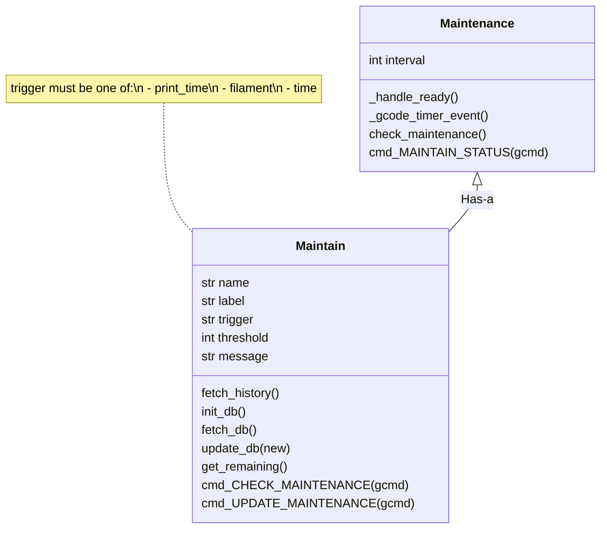

# Example 3: KlipperMaintenance

This last example of the Klippy extra development tutorial is actually one of my other Klipper projects: [KlipperMaintenance](https://github.com/3DCoded/KlipperMaintenance), a maintenance reminder system for Klipper.

This example will go through how the KlipperMaintenance code works to teach a few more important things about developing Klippy extras.

## Full Code

For this tutorial, we'll start with the full code, then break it down and explain what each section does. If you can learn to read existing Klippy extras, you can read the [builtin Klippy extras](https://github.com/Klipper3d/klipper/tree/master/klippy/extras) when developing your own extras.

???+ quote "Full Code"
    ```py
    --8<-- "maintain.py:code"
    ```

## Structure

The class structure of this Klippy extra is shown in this flowchart:



This diagram has a lot of information, but the key points are:

- Multiple `Maintain` objects are managed by one `Maintainence` object.
- The `Maintain` class handles maintenance reminders, the `CHECK_MAINTENANCE` command, and the `UPDATE_MAINTENANCE` command.
- The `Maintenance` class handles the `MAINTAIN_STATUS` command.
- A `[maintain name]` section corresponds to the `Maintain` class (multiple).
- A `[maintain]` section corresponds to the `Maintenance` class (one).

The base code for this is:

```py title="maintain.py" hl_lines="9-19"
--8<-- "maintain.py:import"

--8<-- "maintain.py:consts"

--8<-- "maintain.py:manheader"
    pass

--8<-- "maintain.py:subheader"
    pass

# (1)!
--8<-- "maintain.py:regcfg"

# (2)!
--8<-- "maintain.py:regcfgprfx"
```

1. This function corresponds to a `[maintain]` config section.
2. This function corresponds to a `[maintain name]` config section.

The highlighted section in the code contains the classes, and the configuration loading, the parts relevant to this first section. The code above the highlighted section includes the relevant module imports and constant declarations (both explained later).

Much of the content in this example will be embedded in the code (usually the highlighted section) as a plus sign, like this: (1)
{.annotate}

1. Click some more plus marks in the code to learn more about the code.

## `Maintain` class

This next section of the example will focus on the `Maintain` class.

### Initializer

When `load_config_prefix` creates a `Maintain` object, it starts in the initializer. 

Here's the full initializer, with explanations embedded inside with plus signs. Below is a more general breakdown of the initializer for clarity.

```py title="maintain.py" hl_lines="3-6 8-20 25-26"
--8<-- "maintain.py:subheader"
--8<-- "maintain.py:subinitheader"
        self.config = config
        self.printer = config.get_printer()
        self.gcode = self.printer.lookup_object('gcode')
        self.name = config.get_name().split()[1] # (1)!

        self.label = config.get('label')

        # (2)!
        self.trigger = config.getchoice('trigger', ['print_time', 'filament', 'time']) 
        if self.trigger == 'print_time': # (3)!
            self.units = 'h'
        elif self.trigger == 'filament':
            self.units = 'm'
        elif self.trigger == 'time':
            self.units = 'h'

        self.threshold = config.getint('threshold')
        self.message = config.get('message')

        # (4)!
        self.init_db()

        self.gcode.register_mux_command('CHECK_MAINTENANCE', 'NAME', self.name, self.cmd_CHECK_MAINTENANCE, desc=self.cmd_CHECK_MAINTENANCE_help)
        self.gcode.register_mux_command('UPDATE_MAINTENANCE', 'NAME', self.name, self.cmd_UPDATE_MAINTENANCE, desc=self.cmd_UPDATE_MAINTENANCE_help)
```

1. `#!py config.get_name()` returns the full config name, like `#!py "maintain name"`. The `#!py .split()[1]` splits the name by spaces and gets the last "word".
2. `#!py config.getchoice()` allows you to only accept values in a certain list.
3. This part of the initializer chooses the units based on the `trigger` type:
    - `#!py "print_time"`: `#!py "h"`
    - `#!py "filament"`: `#!py "m"`
    - `#!py "time"`: `#!py "h"`
4. This is explained later, in functions.

The major breakdown of this initializer is:

- **First highlighted section:** Load basic objects
- **Second highlighted section:** Read configuration options
- **Third highlighted section:** Register GCode commands

The line `#!py self.init_db()` will be explained later in functions.

!!! question "Quiz"
    === "Question"
        How would you add another trigger type (called `#!py "axes_distance"` with units `#!py "m"`)?
    === "Answer"
        ```py hl_lines="5 12-13"
        self.trigger = config.getchoice('trigger', [
            'print_time',
            'filament',
            'time',
            'axes_distance'])
        if self.trigger == 'print_time': # (3)!
            self.units = 'h'
        elif self.trigger == 'filament':
            self.units = 'm'
        elif self.trigger == 'time':
            self.units = 'h'
        elif self.trigger == 'axes_distance':
            self.units = 'm'
        ```

### Functions

The next part of the `Maintain` class is its functions. The functions in this class are, broken down into two sections:

**Database:**

- `fetch_history()`
- `init_db()`
- `fetch_db()`
- `update_db(new)`

**GCode:**

- `get_remaining()`
- `cmd_CHECK_MAINTENANCE(gcmd)`
- `cmd_UPDATE_MAINTENANCE(gcmd)`

First, the database functions (again, plus signs throughout the code explain in more detail what each part does):

```py title="maintain.py"
--8<-- "maintain.py:subheader"
    ...
    def fetch_history(self):
        resp = requests.urlopen(API_URL) # fetch data from Moonraker History API
        try:
            json_data = json.loads(resp.read()) 
        except Exception:
            self.gcode.respond_info(f'Data {resp.read()}')
            return {
                'print_time': 0,
                'filament': 0,
                'time': time.time()/3600
            } # (1)!

        job_totals = json_data['result']['job_totals'] # get job totals from JSON response
        return {
            'print_time': job_totals['total_time']/3600,
            'filament': job_totals['total_filament_used']/1000,
            'time': time.time()/3600
        } # (2)!

    def init_db(self):
        data = self.fetch_db() # Load the database
        if data is None:
            data = self.fetch_history()
            self.update_db(data) # Update the database with history data

    def fetch_db(self):
        path = os.path.join(HOME_DIR, f'maintain-db/{self.name}') # (3)!
        if os.path.exists(path):
            with open(path, 'r') as file:
                try:
                    data = json.load(file) # JSON parse the file contents
                except:
                    data = {'print_time': 0, 'filament': 0, 'time': time.time()/3600}
                return data # Return parsed data
    
    def update_db(self, new):
        path = os.path.join(HOME_DIR, f'maintain-db/{self.name}') # (3)!
        os.makedirs(os.path.dirname(path), exist_ok=True) # (4)!
        with open(path, 'w+') as file: # The "w+" file operator allows reading and writing
            try:
                data = json.load(file) # JSON parse the file contents
            except:
                data = {'print_time': 0, 'filament': 0, 'time': time.time()/3600}
            data.update(new) # Update the file contents with the new data
            json.dump(data, file) # JSON write the new data to the file
        return data # Return the new updated data
```

1. In case of an error, empty placeholder data is returned.
2. If history fetch was successful, return the data read from the Moonraker History API.
3. The `path` is (if the username is `pi` and `#!py self.name` is `#!py "lubricate"`) `#!py "/home/pi/maintain-db/lubricate"`. Even though it has no file extension, it stores JSON data.
4. The first time running this, the `maintain-db` folder won't exist. `os.makedirs` creates the folder, and `#!py exist_ok=True` doesn't throw an error if it already exists.

The flow of information in this Klippy extra is:

- `init_db()` is called when Klippy starts
- `fetch_db()` is called to read the stored database
- If the data returned by `fetch_db()` is `None` (database is empty)
    - `fetch_history()` is called to fetch the history stored by Moonraker
    - `update_db()` is called to update the database with the newly fetched data.

Calling `update_db()` will erase the current maintenance state (resetting the timer/filament counter).

---

The next section of functions in the `Maintain` class are the GCode commands. There are three functions in this section:

- `get_remaining()`
- `cmd_CHECK_MAINTENANCE(gcmd)`
- `cmd_UPDATE_MAINTENANCE(gcmd)`