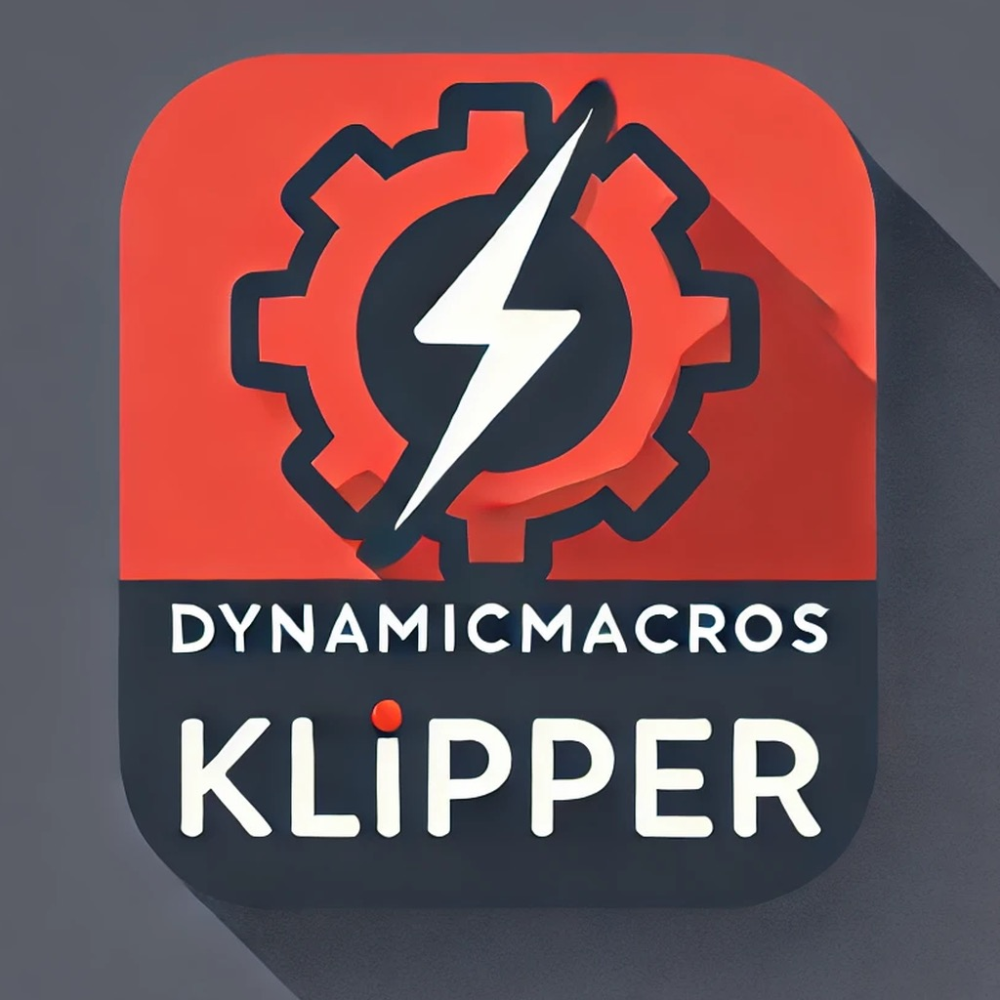

# Klipper Dynamic Macros

**Never restart Klipper again for simple macros.**

---

Klipper Dynamic Macros is an unofficial way to update macros without restarting Klipper, so you can update macros mid-print and see their results live. It also supports many extra features that normal GCode Macros don't have.

[Get Started :fontawesome-regular-paper-plane:](setup.md){.md-button}

## Features

- __:octicons-arrow-both-16: Recursion__

    ---
  
    Allow macros to call themselves internally for more complex logic.
    
    [Learn More :octicons-arrow-right-16:](recursion.md)

- __:fontawesome-solid-arrows-rotate: Receiving Variables__

    ---
  
    Allow macros to update their state while running.
    
    [Learn More :octicons-arrow-right-16:](receivingvariables.md)

- __:material-tools: Utility Functions__

    ---
  
    Reusable helpers and shared logic for complex macro systems.
    
    [Learn More :octicons-arrow-right-16:](utilities.md)

- __:material-variable: Variables & State__

    ---
  
    Persistent variables and runtime state across macro executions.
    
    [Learn More :octicons-arrow-right-16:](variables.md)

- __:simple-python: Embedded Python__

    ---
  
    Use Python expressions and helpers directly inside macros.
    
    [Learn More :octicons-arrow-right-16:](python.md)

- __:octicons-eye-16: Rendering & Templating__

    ---
  
    Render your macros before running them to quickly iterate on logic.
    
    [Learn More :octicons-arrow-right-16:](rendering.md)

- __:octicons-clock-16: Delayed GCode__

    ---
  
    All the above features are also available in `delayed_gcode` sections.
    
    [Learn More :octicons-arrow-right-16:](delayed.md)

- __:material-format-list-group: Macro Clusters__

    ---
  
    Group related macros into structured, modular systems, with optional safety systems in place.
    
    [Learn More :octicons-arrow-right-16:](clusters.md)

| Normal Macro | Dynamic Macro |
| ------------ | ------------- |
| Macros read once from configuration file | Macros read once then reloaded on demand |
| Requires restart to update macros | Updates macros on demand |
| Does not support recursion | Allows recursion |
| Internal state is fixed within macro run | Internal state can be updated during macro run |
| Does not allow pre-rendering macros | Allows pre-rendering macros |

!!! info
    Unlike traditional G-Code macros, Dynamic Macros are **not** included in your `printer.cfg` and are instead defined in a separate file. They are instead read by a `[dynamicmacros]` section in your `printer.cfg`. 

## Klippy Extras Tutorial

DynamicMacros also includes a [tutorial on writing Klippy extras](extras-start.md).

[Get Started :fontawesome-regular-paper-plane:](setup.md){.md-button}

## Examples

See [Example Macros](examples.md) for examples of Dynamic Macros.

## More Projects

If you like this project, don't forget to give it a star! Also, check out the [3MS](https://github.com/3dcoded/3ms), a modular multimaterial system for Klipper!